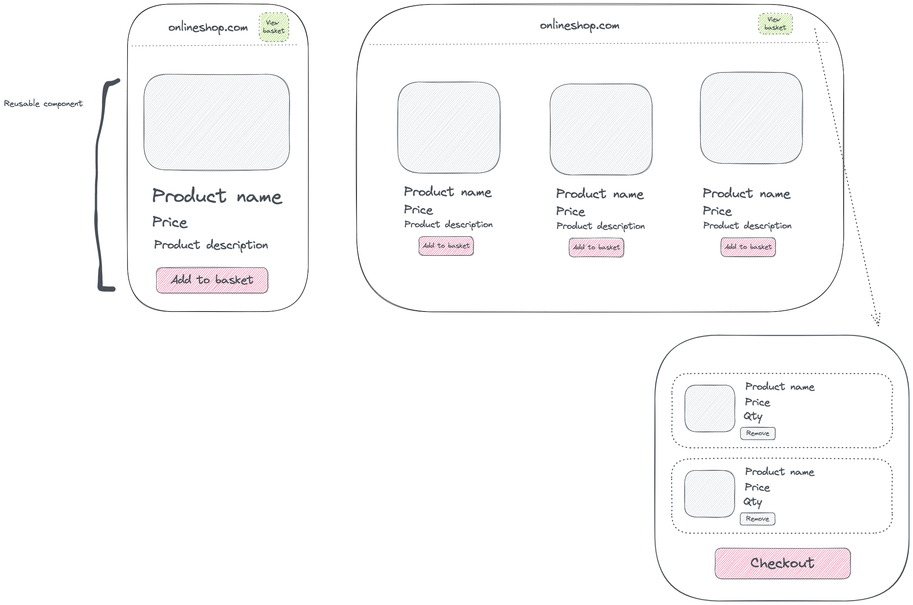

## Live demo 
https://clothifyshop.netlify.app/ 

*It may take a few seconds for the API to respond and UI to render*

## Goals
- Develop a MVP within a time-frame
- Mobile-first approach and make application as responsive as possible
- Achieve all user requirements 
- Deploy MVP

## Technology
- React.js chosen for easy set-up, flexibility and use of components and Next.js in order to have persistent components (mini-basket in navigation) and routing. When this application has been developed further there will be multiple pages for products and Next.js will be extremely useful for this. 
- Chakra UI was utilised for this application due to time constraints and wanting to spend enough time on logic, and less time on building components from scratch. Chakra's strengths lie in the use of breakpoints which makes creating responsive applications easier.

## Plan

1. Design a basic MVP that meets the relevant criteria. This also involved reading the API documentation and testing the endpoints and choosing what data to work with. I followed the 'make it work, make it fast, make it pretty' mantra and did not prioritise design but still wanted to follow the design-thinking process and make something as useful and equitable as possible.

2. Broke the MVP down in terms of what user requirements needed to be achieved:
- As an online customer, I want to see a page where I can view all products 
- As an online customer, I want to click on a button and be able to add a product to my basket 
- As an online customer, I need to add a product to a mini basket, so that I can proceed to purchase.
- As an online customer, I want to view my mini basket, so that I can see all my products I have added to purchase.
- As an online customer, I want to update the quantity of an item in my mini basket, so that I can purchase more than one of the same item.
- As an online customer, I want to update my mini basket, so that I can add and/or remove an item.
- As an online customer, I want to view my mini basket, so that I can see the total value of my basket.
- As an online customer, I want my mini basket to always display the exact items I added no matter what page I am on , so that I am free to navigate throughout the store and never lose what’s in my basket.

3. Planned out the components and decided what states would be required and what props would need to be passed.

4. Outlined a set of starter tests to incorporate. Currently, I am looking for opportunities to incorporate TDD in my development projects but opted against it due to time-constraints and wanting to have enough time to write implementation code. Unit testing would still be required and this involved looking at the MVP and translating the user stories into requirements before writing unit tests. These included:

- Testing that all functional components and their props were rendered successfully
- Testing the 'add to basket' button, once clicked, correctly updates the quantity of a product if currently in basket OR adds the product to the basket with a quantity of 1
- Testing that the navigation/basket correctly displays the number of items in the online customer's current basket
- Testing logic within the mini-basket such as:
    - The correct rendering of items (do they have a image, title, price, quantity...)
    - The correct sub-total is displayed
    - If an online customer clicks on the 'remove' button, does the basket state update correctly? 